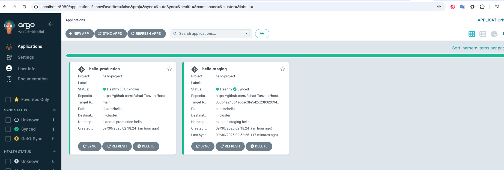

# Hostaway DevOps Engineer Task

This repository contains the solution for the **Hostaway DevOps Task**, focusing on establishing a local, GitOps-driven Kubernetes environment using **Minikube, Terraform, ArgoCD, and Kargo**.

---

## Prerequisites

Before running the setup script, ensure the following tools are installed and accessible on your system:

- [Minikube](https://minikube.sigs.k8s.io/docs/) – For running the local Kubernetes cluster  
- [kubectl](https://kubernetes.io/docs/tasks/tools/) – The Kubernetes command-line tool  
- [Terraform](https://www.terraform.io/) – For provisioning cluster components and namespaces. `version = v1.5.7`
- [Helm](https://helm.sh/) – The Kubernetes package manager  
- [Git](https://git-scm.com/) – For managing the application repository  
- Repository access – Ensure your GitHub user is a collaborator on this repository

---

## 1-Command Setup and Run

To initialize the entire environment, run the following commands from the root of this repository:

```bash
chmod +x ./setup.sh
./setup.sh
```

### Troubleshooting

- If you see CRD/webhook timing errors (e.g., "isn't valid for cluster" or admission webhook denied), just rerun:

```bash
cd terraform && terraform apply -auto-approve
```

## Setup Script Overview

The `./setup.sh` script triggers Terraform to provision the stack in this order:

1. **Minikube Start** – Starts the local Kubernetes cluster.  
2. **Terraform Provisioning** – Creates application and system namespaces:  
   - Application: `external-staging-hello`, `external-production-hello`  
   - System: `argocd`, `kargo`, `cert-manager`  
3. **Helm Installation (cert-manager)** – Installs cert-manager into the `cert-manager` namespace.  
4. **Helm Installation (Argo CD)** – Installs Argo CD into the `argocd` namespace.  
5. **Helm Installation (Kargo)** – Installs Kargo into the `kargo` namespace.  
6. **Argo CD Project & Applications** – Creates the AppProject and the `hello-staging` and `hello-production` Applications that sync the Helm chart from Git.  
   - Note: The `hello` project namespace is created by Kargo during Project initialization. Do not pre-create it.  


## Accessing the Tooling

### 1. ArgoCD (GitOps Synchronization)

ArgoCD is responsible for continuously synchronizing the desired state defined in Git to the cluster.

Run the command below to access the ArgoCD Web UI:

```bash
kubectl port-forward -n argocd svc/argocd-server 8080:80
```

**Access Details:**

- **Host:** [http://localhost:8080/](http://localhost:8080/)  
- **Username:** `admin`  
- **Password:** `admin`

You will see the `hello-staging` and `hello-production` applications deployed in the ArgoCD UI, which may initially be in an `Unknown` or `Degraded` state until `Kargo` promotes the first successful commit.




### 2. Kargo (Deployment Progression and Rollback)

Kargo manages the release promotion pipeline (**Staging → Production**) and provides a clear view of available commits for rollback.

Run the command below to access the Kargo Web UI:

```bash
kubectl port-forward -n kargo svc/kargo-api 8081:443
```

**Access Details:**

- **Host:** [https://localhost:8081/](https://localhost:8081/)  
- **Username:** `admin`  
- **Password:** `admin`

In the Kargo UI, click on the hello project. You will see the pipeline (similar to the image below), visualizing the flow from the source repository to the hello-staging and hello-production stages.


Promoting a release in Kargo updates the targetRevision of the corresponding Argo CD Application to the selected commit SHA; Argo CD then syncs that revision to the cluster.


## GitOps Workflow: Deployment, Promotion, and Rollback

We use **Kargo** to manage the movement of releases between environments.

### 1. Deploying a New Version (Source Change)

- **Update the Application:** Modify the application source code (e.g., [change the "hello it's me" message](https://github.com/Fahad-Tanveer/hostaway-challenge/blob/main/charts/hello/values.yaml#L43)) and commit the changes to the source repository's main branch.  
- **Kargo Detection:** Kargo automatically detects the new commit SHA in the source repository.  
- **Promote to Staging:** In the Kargo UI, find the new commit at the top of the Commits list. Promote this new commit/release to the `hello-staging` stage.  
- **ArgoCD Sync:** Kargo automatically updates the target revision of the `hello-staging` ArgoCD Application to the new commit SHA. ArgoCD then synchronizes the change to the `external-staging-hello` namespace.  


### 2. Canary Deployments in Staging

The staging environment uses **Argo Rollouts** for advanced canary deployment patterns, providing safer deployments with traffic splitting and rollback capabilities.


#### Staging Canary Configuration

The `hello-staging` application uses:
- **Argo Rollouts** for deployment strategy
- **50% traffic split** between stable and canary versions
- **Indefinite pause** for manual intervention
- **NGINX Ingress Controller** for traffic routing

#### Canary Deployment Workflow

1. **Git Push**: Update application code and push to Git repository
2. **Kargo Promotion**: Use Kargo to promote the latest commit to staging
3. **Argo CD Sync**: Argo CD syncs the promoted commit to staging namespace
4. **Rollout Creation**: Argo Rollouts creates new ReplicaSet (canary) alongside stable version
5. **Traffic Split**: NGINX Ingress routes 50% traffic to canary, 50% to stable
6. **Pause**: Rollout pauses for testing and validation
7. **Manual Decision**: Promote to 100% or abort and rollback

#### Monitoring Canary Deployments

**Argo Rollouts Dashboard**:
```bash
kubectl argo rollouts dashboard
# Opens at http://localhost:3100
```

#### Testing Traffic Splitting

**Port Forward to NGINX Ingress**:
```bash
kubectl port-forward -n ingress-nginx svc/ingress-nginx-controller 8082:80
```

**Test with curl** (during canary deployment):
```bash
curl -H "Host: hello-staging.local" http://localhost:8082/
```

**Expected Behavior**: You'll see responses from both stable and canary versions as traffic is split 50/50.

#### Integration with Kargo

The canary deployment in staging integrates seamlessly with the Kargo promotion workflow:

1. **Staging Canary**: Use Argo Rollouts for safe canary testing
2. **Manual Promotion**: After successful canary testing, use Kargo to promote to production
3. **Production Deployment**: Standard rolling deployment in production environment

This provides the best of both worlds - safe canary deployments in staging with manual control, and streamlined promotion to production via Kargo.

### 3. Promotion to Production

- **Promote Upstream:** In the Kargo UI, select the `hello-production` stage.  
- **Promote:** Click the promotion button and select the upstream stage (`hello-staging`) as the source for the promotion.  
- **ArgoCD Sync:** Kargo updates the target revision of the `hello-production` ArgoCD Application to match the version running in Staging. ArgoCD synchronizes the successful release to the `external-production-hello` namespace.  


### 4. Rollback

- **Identify Target Version:** In the Kargo UI, view the Commits history and identify the commit SHA of the previous, stable version you wish to roll back to.  
- **Execute Rollback:**  
  1. Select the target stage (`hello-production`).  
  2. Click the promotion button, but instead of using the upstream stage, select the specific known-good Commit SHA from the list.  
- **Result:** Kargo immediately updates the ArgoCD application to point to the older SHA, initiating a rollback to the previous stable state.  


## Application Access and Metrics

The application is deployed to two separate namespaces: `external-staging-hello` and `external-production-hello`.

### Accessing the Application

Use `kubectl port-forward` to access the staging environment locally:

```bash
kubectl -n external-staging-hello port-forward svc/hello-staging 8082:80 4040:4040
```

### Application Endpoints

- **Nginx Web Server:** [http://localhost:8082](http://localhost:8082)  
- **Metrics Endpoint:** [http://localhost:4040/metrics](http://localhost:4040/metrics)  

**Success Endpoint Example:**

```bash
curl -s http://localhost:8082/success
```

**Expected Output (Example):**

```json
{
  "message": "hello its me",
  "version": "1.0.0-staging",
  "environment": "staging",
  "timestamp": "...",
  "endpoint": "/success",
  "status": "success"
}
```

**Failure Endpoint Example (Always returns 500):**

```bash
curl -i http://localhost:8082/fail
```

## Key Monitoring Metrics and Thresholds

We manage the reliability of our service using a framework based on **Service Level Indicators (SLIs)**, **Service Level Objectives (SLOs)**, and **core incident metrics**.

---

### SRE Framework Definitions

- **SLI (Service Level Indicator):**  
  A quantitative measurement of the service level we provide (e.g., latency, success rate).

- **SLO (Service Level Objective):**  
  The target value for a chosen SLI. This is our internal commitment to reliability (e.g., 99.9% uptime).

- **MTTD (Mean Time to Detection):**  
  The average time taken to detect that a service-level breach has occurred.


### Application-specific SLIs and SLOs (hello service)

Data source: the `prometheus-nginxlog-exporter` sidecar on port `4040` exposes request metrics for the `hello service`. Metrics include an `env` label (`staging` or `production`).

- **SLI: Availability (success rate)**
  - Why it’s necessary: ensures users can reliably hit `/`, `/success`, and `/health` without server errors; captures backend or config regressions quickly.
  - SLOs: staging ≥ 99.0%; production ≥ 99.9% (5-minute windows)
  - Alerting: page if production < 99.5% for 5 minutes; warn if staging < 98.5% for 10 minutes.

- **SLI: Latency (P95)**
  - Why it’s necessary: Captures tail performance experienced by real users; protects user experience from slow responses due to resource contention or inefficient templates.
  - SLO: P95 latency ≤ **300ms** over a rolling 5-minute window (staging and production).
  - Alerting Threshold: Trigger an alert if P95 latency exceeds **400ms** for 3 consecutive minutes in either environment.

- **SLI: Traffic (QPS) — production drop detection**
  - Why it’s necessary: detects sudden demand collapse from routing issues, DNS problems, or app crashes even if health checks remain green.
  - Alerting: trigger on sharp traffic drops (e.g., >80% vs prior 15-minute baseline).

- SLO/Error budget policy
  - Why it’s necessary: the 99.9% production SLO implies ~43.2 minutes monthly error budget; overrun means we pause non-critical changes and focus on reliability.


### Minikube Stability and Reliability

These SLIs focus on the operational health of the local cluster and its ability to maintain desired state for the hello workloads.

- **SLI: Pod restart rate (hello namespaces)**
  - Why it’s necessary: detects crash loops and memory/CPU starvation impacting availability of `hello` Pods.
  - Alerting: any single Pod with >3 restarts in 15 minutes (staging or production) triggers an incident.

- **SLI: Scheduling stability (hello workloads)**
  - Why it’s necessary: prolonged Pending or frequent evictions indicate insufficient cluster capacity or node instability.
  - Alerting: any `hello` Pod Pending >5 minutes; and noticeable spikes in `kube_node_not_ready` events.

- **SLI: Resource contention (CPU and memory, hello Pods)**
  - Why it’s necessary: sustained high utilization leads to throttling or OOMKills, causing latency spikes and outages.
  - Alerting: CPU >85% of Pod request for 10 minutes; Memory >90% of request for 5 minutes or any OOMKill event.


### GitOps Tooling Health

Automation layers **Argo CD** and **Kargo** enforce the desired state; their health is critical for reliable delivery.

- **SLI: Argo CD application status (hello-production)**
  - Why it’s necessary: sustained `OutOfSync`/`Degraded` means the cluster diverges from Git, blocking safe rollbacks and drift correction.
  - Alerting: `hello-production` is `Degraded` or `OutOfSync` for >10 consecutive minutes.

- **SLI: Kargo promotion outcomes (hello project)**
  - Why it’s necessary: failed or stuck promotions halt Staging → Production flow and leave environments inconsistent.
  - Alerting: any promotion remains `Failed` (or equivalent) for >15 minutes.


### Incident Response Goal (MTTD)

- Metric: Mean Time to Detection (MTTD)
  - Target: ≤ 5 minutes (production)
  - Why it’s necessary: ensures engineers are paged promptly when SLIs breach, minimizing user impact while avoiding noise via sustained thresholds.

